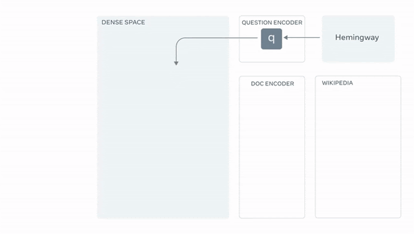
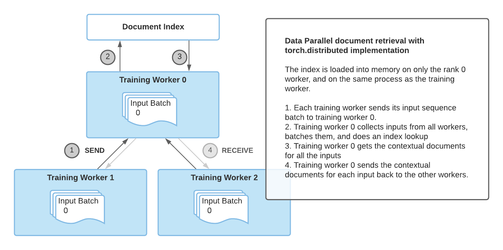
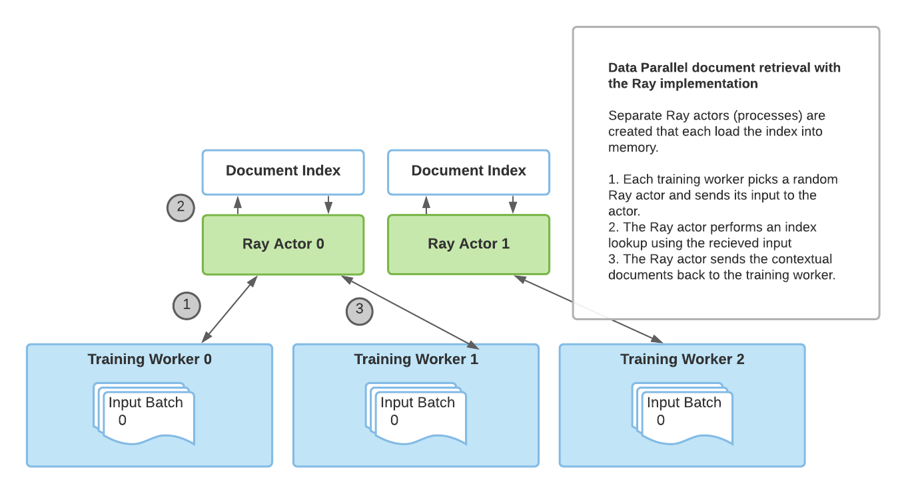

## Retrieval Augmented Generation with Huggingface Transformers and Ray

_[Huggingface Transformers](https://huggingface.co/) recently added the [Retrieval Augmented Generation (RAG)](https://twitter.com/huggingface/status/1310597560906780680) model, a new NLP model architecture that leverages external documents (like Wikipedia) to augment its knowledge and achieve state of the art results on knowledge intensive tasks. In this blog post we introduce the addition of [Ray](https://docs.ray.io/en/master/), a library for building scalable applications, for RAG contextual document retrieval, resulting in 2x speedup per retrieval call and allowing distributed [fine-tuning](https://github.com/huggingface/transformers/tree/master/examples/research_projects/rag) of RAG to scale._

### What is Retrieval Augmented Generation (RAG)?


_An overview of Retrieval Augmented Generation Model. Note that a key component of the model is the retrieval of contextual documents from an external dataset. These contextual documents are using in conjunction with the original input to get the output sequence. Video taken from [this blog post](https://ai.facebook.com/blog/retrieval-augmented-generation-streamlining-the-creation-of-intelligent-natural-language-processing-models)._

Recently, [Huggingface](https://huggingface.co/) partnered with [Facebook AI](https://ai.facebook.com/) to introduce [Retrieval Augmented Generation](https://twitter.com/huggingface/status/1310597560906780680) model as part of its library. [Retrieval Augmented Generation](https://ai.facebook.com/blog/retrieval-augmented-generation-streamlining-the-creation-of-intelligent-natural-language-processing-models/), or RAG, was [published in NeurIPS 2020](https://arxiv.org/abs/2005.11401) and is a new architecture that retrieves contextual documents from a text corpus (like Wikipedia) to augment its knowledge. RAG has shown to be successful in a variety of knowledge-intensive tasks that require external sources, such as Q&A, fact verification, and Jeopardy style question generation.

[RAG](https://ai.facebook.com/blog/retrieval-augmented-generation-streamlining-the-creation-of-intelligent-natural-language-processing-models/) acts just like any other [seq2seq model](https://blog.keras.io/a-ten-minute-introduction-to-sequence-to-sequence-learning-in-keras.html), but the fundamental difference is that [RAG](https://ai.facebook.com/blog/retrieval-augmented-generation-streamlining-the-creation-of-intelligent-natural-language-processing-models/) has an intermediate step where it queries an external knowledge base to find contextual documents which are used in conjunction with the original sequence and passed into the [generator](https://huggingface.co/blog/how-to-generate).

This information retrieval step allows [RAG](https://ai.facebook.com/blog/retrieval-augmented-generation-streamlining-the-creation-of-intelligent-natural-language-processing-models/) to make use of multiple sources of knowledge -- those that are baked into the model parameters and the information that is contained in the contextual passages, allowing it to outperform other state-of-the-art seq2seq models. 

You can even try RAG for yourself using this [demo provided by Huggingface](https://huggingface.co/rag/), or find out more information on RAG in this [blog post written by the authors](https://ai.facebook.com/blog/retrieval-augmented-generation-streamlining-the-creation-of-intelligent-natural-language-processing-models)!

### Scaling up fine-tuning
This retrieval of contextual documents is crucial for RAG's state-of-the-art results, but this component adds new complexities when fine-tuning the model on a downstream task, specifically in a distributed setup. As we scale up the training, we also have to appropriately scale up the document index lookup so the retrieval is not a bottleneck. And in a data parallel multi-GPU setup where there are multiple training workers each acting on different inputs, it’s not feasible for each worker to load its own copy of the entire index due to its size.

The previous implementation of RAG fine-tuning leveraged the [torch.distributed](https://pytorch.org/docs/stable/distributed.html) communication package for the  document retrieval portion. However, this implementation proved to be inflexible and limited scalability.

Instead, we needed a framework-agnostic and a more flexible implementation for ad-hoc concurrent RPC, and [Ray](https://ray.io/) fit the bill perfectly. [Ray](https://ray.io/) is a simple, yet powerful Python library for general-purpose distribtued and parallel programming. Using [Ray](https://ray.io/) for distributed document retrieval, we achieved **2x speedup per retrieval call compared to torch.distributed**, and overall better fine-tuning scalability.

### Ray for Document Retrieval

_Document retrieval with the torch.distributed implementation_


The main drawback of the [torch.distributed](https://pytorch.org/docs/stable/distributed.html) implementation for document retrieval was that it latched on to the same process group used for training and only the rank 0 training worker loaded the index into memory.

As a result, this implementation had some limitations:

1. **Synchronization bottleneck**: The rank 0 worker had to receive the inputs from all workers, perform the index query, and then send the results back to the other workers. This limited performance with multiple training workers.
2. **Pytorch specific**: The document retrieval process group had to latch onto the existing process group used for training, meaning that Pytorch had to be used for training as well.


_Document retrieval with the Ray implementation_

To overcome these limitations, we introduced a [Ray](https://docs.ray.io/en/master/) based implementation of distributed retrieval. With [Ray’s stateful actor abstractions](https://docs.ray.io/en/master/actors.html), multiple processes that are separate from the training processes are used to load the index and handle the retrieval queries. With multiple Ray actors, retrieval is no longer a bottleneck and Pytorch is no longer a requirement for RAG.

And as you can see below, using the [Ray](https://docs.ray.io/en/master/) based implementation leads to better retrieval performance for multi-GPU fine-tuning. The following results show the seconds per retrieval call and we can see that as we increase the number of GPUs that we train on, using Ray has comparatively better performance than `torch.distributed`. Also, if we increase the number of Ray processes that perform retrieval, we also get better performance with more training workers since a single retrieval process is no longer a bottleneck.


<table>
  <tr>
   <td>
   </td>
   <td>2 GPU
   </td>
   <td>3 GPU
   </td>
   <td>4 GPU
   </td>
  </tr>
  <tr>
   <td>torch.distributed
   </td>
   <td>2.12 sec/retrieval
   </td>
   <td>2.62 sec/retrieve
   </td>
   <td>3.438 sec/retrieve
   </td>
  </tr>
  <tr>
   <td>Ray 2 retrieval processes
   </td>
   <td>1.49 sec/retrieve
   </td>
   <td>1.539 sec/retrieve
   </td>
   <td>2.029 sec/retrieve
   </td>
  </tr>
  <tr>
   <td>Ray 4 retrieval processes
   </td>
   <td>1.145 sec/retrieve
   </td>
   <td>1.484 sec/retrieve
   </td>
   <td>1.66 sec/retrieve
   </td>
  </tr>
</table>


_A performance comparison of different retrieval implementations. For each document retrieval implementation, we run 500 training steps with a per-GPU batch size of 8, and measure the time it takes to retrieve the contextual documents for each batch on the rank 0 training worker. As the results show, using multiple retrieval processes improves performance, especially as we scale training to multiple GPUs._


### How do I use it?

[Huggingface](https://huggingface.co/) provides a [Pytorch Lightning](https://github.com/PyTorchLightning/pytorch-lightning) based [fine tuning script](https://github.com/huggingface/transformers/tree/master/examples/research_projects/rag), and we extended it to add the Ray retrieval implementation as an option. 

To try it out, first install the necessary requirements


```
pip install ray
pip install transformers
pip install -r transformers/examples/research_projects/rag/requirements.txt
```


Then, you can specify your data paths and other configurations and run [finetune-rag-ray.sh](https://github.com/huggingface/transformers/blob/master/examples/research_projects/rag/finetune_rag_ray.sh)!


```
# Sample script to finetune RAG using Ray for distributed retrieval.

# Add parent directory to python path to access lightning_base.py
export PYTHONPATH="../":"${PYTHONPATH}"

# Start a single-node Ray cluster.
ray start --head

# A sample finetuning run, you need to specify data_dir, output_dir and model_name_or_path
# run ./examples/rag/finetune_rag_ray.sh --help to see all the possible options

python examples/rag/finetune_rag.py \
    --data_dir $DATA_DIR \
    --output_dir $OUTPUT_DIR \
    --model_name_or_path $MODEL_NAME_OR_PATH \
    --model_type rag_sequence \
    --fp16 \
    --gpus 8 \
    --profile \
    --do_train \
    --do_predict \
    --n_val -1 \
    --train_batch_size 8 \
    --eval_batch_size 1 \
    --max_source_length 128 \
    --max_target_length 25 \
    --val_max_target_length 25 \
    --test_max_target_length 25 \
    --label_smoothing 0.1 \
    --dropout 0.1 \
    --attention_dropout 0.1 \
    --weight_decay 0.001 \
    --adam_epsilon 1e-08 \
    --max_grad_norm 0.1 \
    --lr_scheduler polynomial \
    --learning_rate 3e-05 \
    --num_train_epochs 100 \
    --warmup_steps 500 \
    --gradient_accumulation_steps 1 \
    --distributed_retriever ray \
    --num_retrieval_workers 4

# Stop the Ray cluster.
ray stop
```

## What’s next?

Using [RAG](https://ai.facebook.com/blog/retrieval-augmented-generation-streamlining-the-creation-of-intelligent-natural-language-processing-models) on [Huggingface transformers](https://github.com/huggingface/transformers/tree/master/examples/research_projects/rag) and the [Ray retrieval implementation](https://github.com/huggingface/transformers/blob/master/examples/research_projects/rag/finetune_rag_ray.sh) for faster distributed fine-tuning, you can leverage RAG for retrieval-based generation on your own knowledge-intensive tasks.

Also, hyperparameter tuning is another aspect of transformer fine tuning and can have [huge impacts on accuracy](https://medium.com/distributed-computing-with-ray/hyperparameter-optimization-for-transformers-a-guide-c4e32c6c989b). For scalable and easy hyperparameter tuning, check out the [Ray Tune](https://docs.ray.io/en/latest/tune/) library. By using [Ray Tune’s integration with Pytorch Lightning](https://medium.com/distributed-computing-with-ray/scaling-up-pytorch-lightning-hyperparameter-tuning-with-ray-tune-4bd9e1ff9929), or the [built-in integration with Huggingface transformers](https://huggingface.co/blog/ray-tune), you can run experiments to find the perfect hyperparameters for your RAG model.

And lastly, stay tuned for a potential Tensorflow implementation of [RAG](https://ai.facebook.com/blog/retrieval-augmented-generation-streamlining-the-creation-of-intelligent-natural-language-processing-models) on [Huggingface](https://huggingface.co/)!

If you plan to try RAG+Ray integration out, please feel free to share your experiences on the [Ray Discourse](https://discuss.ray.io/) or join the [Ray community Slack](https://docs.google.com/forms/d/e/1FAIpQLSfAcoiLCHOguOm8e7Jnn-JJdZaCxPGjgVCvFijHB5PLaQLeig/viewform) for further discussion -- we’d love to hear from you!
